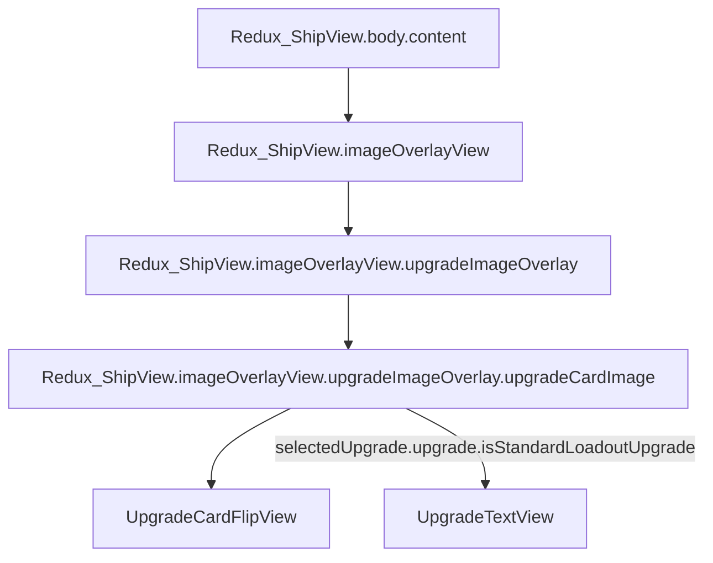
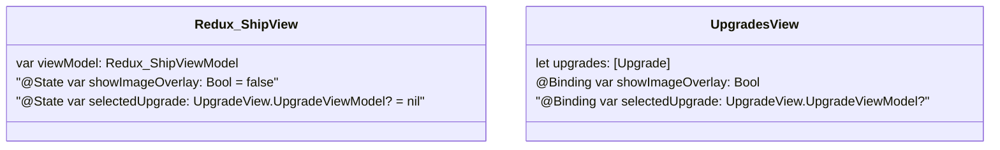
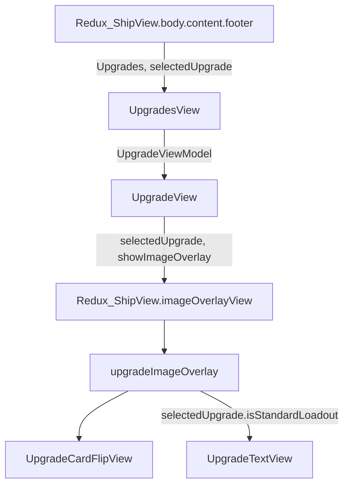
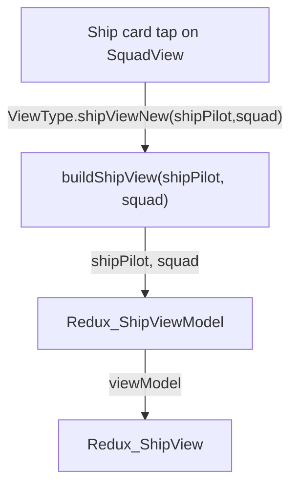
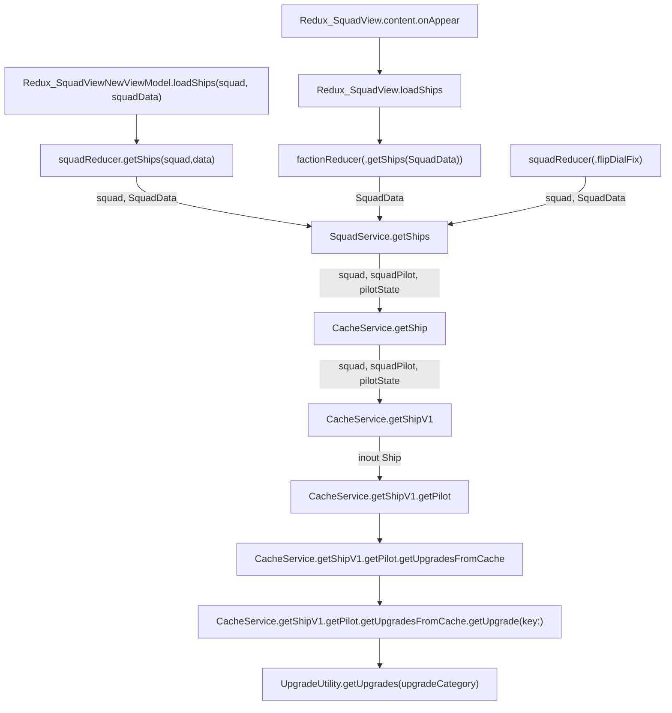
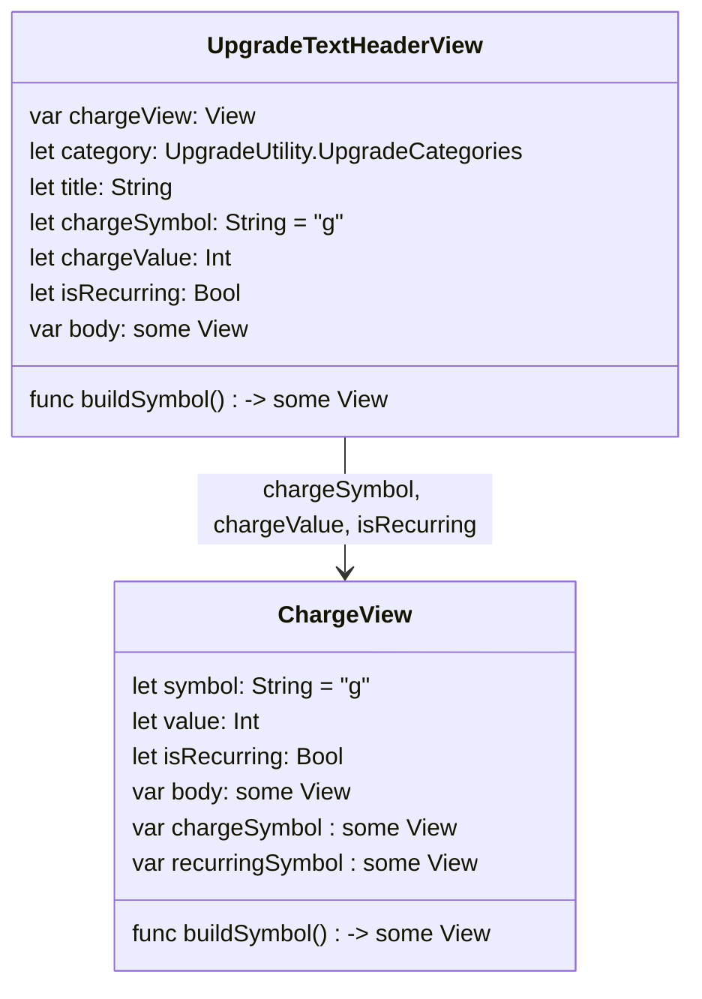
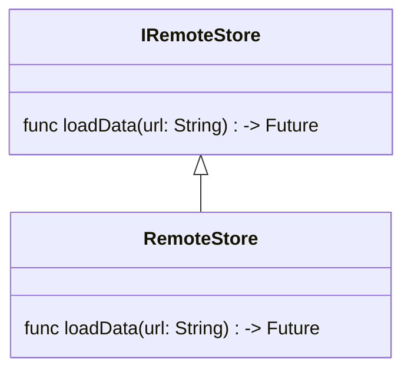
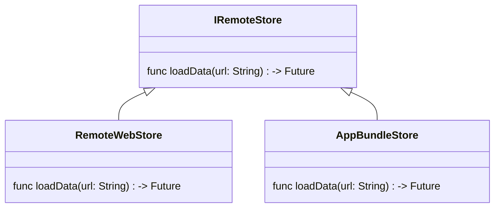
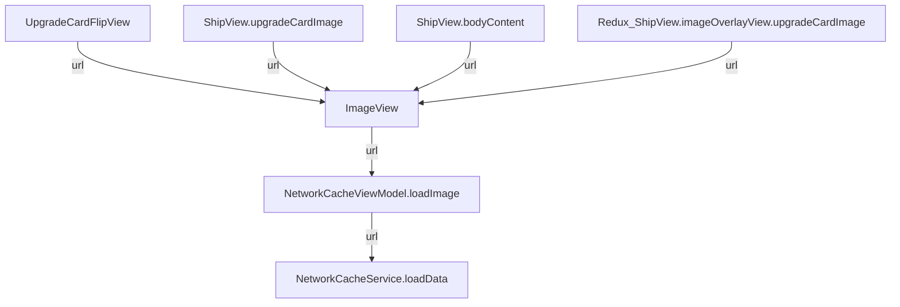

# Standard Loadout Upgrade View

The upgrade view for a standard loadout should look like:


- Which is represented by a Swift UI view
- The body consists of Text and Symbol segments


- The upgrade text is taken from the Blank Signature sides.ability node in upgrades/sensor.json
- `findDelimitedSubstrings(input:) -> [String]` returns an array of the substrings.  This function is a member of UpgradeTextView class (Views/UpgradeView.swift)

|Index|Value|
|-|-|
|0|"While defending, if you are "|
|1|"[Charge]"|
|2|" to change 1 "|
|3|"[Focus]"|
|4|" result to an "|
|5|"[Evade]"|
|6|" result."|

- `createSubstringArray(input:) -> [SubstringType]` converts the string array into a `[SubstringType]` array

|Index|Value|
|-|-|
|0|SubstringType.Text("While defending, if you are ")|
|1|SubstringType.Symbol("[Charge]")|
more...

- Merge any contiguous substrings, if needed.
> For the cases where the string is " perform a [1 [Straight]] " in the sides.ability node of the upgrade.

`mergeSameSubstringTypes(_ input: [SubstringType]) -> [SubstringType]`

- Build a SwiftUI view from the `[SubstringType]` array.

```swift
func buildViews(_ input: [SubstringType]) -> some View {
    func buildView(_ type: SubstringType) -> Text {
        switch(type) {
            case .text(let val):
            return Text(val)
        case .symbol(let val):
            return Text(getSymbol(val))
                .font(.custom("xwing-miniatures", size: 18))
        }
    }

    return VStack(alignment: .center) {
        input.reduce(Text(""), { $0 + buildView($1) } )
    }
}
```

> `getSymbol(val:)` returns a character from the xwing-miniatures font that corresponds to the associated type of the symbol in the `[SubstringType]` array. (`SubstringType.Symbol("[Charge]")` corresponds to the `g` character in the xwing-miniatures font)





The `UpgradesView` is built, passing in the `[Upgrades]` and any `@State` variables which are used as `@Binding` variables in `UpgradesView`.

`Redux_ShipView.body.content.footer`:
```swift
var footer: some View {
    UpgradesView(upgrades: viewModel.shipPilot.upgrades,
                    showImageOverlay: $showImageOverlay,
                    imageOverlayUrl: $imageOverlayUrl,
                    imageOverlayUrlBack: $imageOverlayUrlBack,
                    selectedUpgrade: $selectedUpgrade)
        .environmentObject(viewModel)
}
```
UpgradesView.swift:
```swift
ForEach(upgrades) {
    UpgradeView(viewModel: UpgradeView.UpgradeViewModel(upgrade: $0))
    { upgradeViewModel in
        self.showImageOverlay = true
        self.imageOverlayUrl = upgradeViewModel.imageUrl
        self.imageOverlayUrlBack = upgradeViewModel.imageUrlBack
        self.selectedUpgrade = upgradeViewModel
    }
    .environmentObject(viewModel)
}
```
The closure passed into `UpgradeView` is executed when an upgrade button is tapped.  

- The `showImageOverlay` is set to true when the upgrade button is tapped
- The `selectedUpgrade` is set when the upgrade button in the footer of the ship view is tapped.  It is set to the `UpgradeView.UpgradeViewModel` which is initialized from the  `Upgrade`

The `body` of `Redux_ShipView` adds the `imageOverlayView` as an overlay:

`Redux_ShipView.body`:
```swift
return VStack(alignment: .leading) {
                headerView
                bodyContent
                footer
            }
            .padding()
            .overlay(imageOverlayView)
```

The `showImageOverlay` toggles whether the `upgradeImageOverlay` or the `defaultView` is displayed:
`Redux_ShipView.imageOverlayView`:
```swift
if (self.showImageOverlay == true) {
    return AnyView(upgradeImageOverlay)
} else {
    return defaultView
}
```

The `upgradeImageOverlay` references the `upgradeCardImage` which displays the `UpgradeCardFlipView`:
```swift
if (self.imageOverlayUrlBack != "") {
    guard let selectedUpgrade = self.selectedUpgrade else { return emptyView }
    
    guard let upgradeState = getUpgradeStateData(upgrade: selectedUpgrade.upgrade) else { return emptyView }
    
    // if not standard loadout upgrade
    ret =
        UpgradeCardFlipView(
            side: (upgradeState.selected_side == 0) ? false : true,
            frontUrl: self.imageOverlayUrl,
            backUrl: self.imageOverlayUrlBack,
            viewModel: self.viewModel) { side in
                self.viewModel.update(
                    type: PilotStatePropertyType.selectedSide(upgradeState,
                                                                side), active: -1, inactive: -1
                )
        }.eraseToAnyView()
    
    // if standard loadout upgrade
    // ret = UpgradeTextView
}
```


Tasks
- Add `var isStandardLoadout: Bool = false` to `Upgrade`
- Set `isStandardLoadout` when building the `Redux_ShipViewModel.shipPilot.upgrades` that is injected into `Redux_ShipView` from `ContentView.Redux_buildView()`.  which is triggered from tapping a ship card on the squad view.


ContentView.swift
```swift
func Redux_buildView(type: ViewType) -> AnyView {
    case .shipViewNew(let shipPilot, let squad):
                return buildShipView(shipPilot: shipPilot, squad: squad)
}
```
```swift
func buildShipView(shipPilot: ShipPilot, squad: Squad) -> AnyView {
    let viewModel = Redux_ShipViewModel(moc: self.moc,
                                    shipPilot: shipPilot,
                                    squad: squad,
                                    pilotStateService: self.diContainer.pilotStateService,
                                    store: store)
    
    return AnyView(Redux_ShipView(viewModel: viewModel)
        .environmentObject(self)
    )
}
```





# Upgrade text header view
The header of the upgrade text view consists of
- upgrade category symbol
- upgrade title
- chages, if any


We can represent the header as a view:



# Loading Images from an app Bundle
https://stackoverflow.com/questions/66996051/issue-with-image-not-found-in-bundle-for-app

Instead of loading the images from a remote web server, we'd like to load the images from the app bundle. 



The `RemoteStore` fetches images from a web server, but we also need to support fetching images from an app bundle, so we define a class called `RemoteWebStore` and `RemoteAppBundleStore`.
> Here `Remote` just differentiates the download process from the cache (`Local`)



The call hierarchy:



