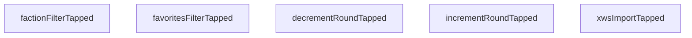

# Squad Manager User Service
Create a service that exposes an API that the UI would call in response to user events.
- Benefits
    - Provides functionality for all user behaviors within the app
    - Allows different devices/clients to use a unified API.  The API can be tested independently of any UI (iPad, browser, CLI, Unit Test)
    - Enables conversion to another framework (node.js, React, etc.)

## Enumerations

`UserAction`
Container enum for all actions.

```swift
enum UserAction {
    case factionSquadList(action: FactionSquadListUserAction)
    case squadView(action: SquadViewUserAction)
    case shipView(action: ShipViewUserAction)
    case upgradeCard(action: UpgradeCardUserAction
```

`FactionSquadListUserAction`

```swift
enum FactionSquadListUserAction {
    case factionFilterTapped
    case favoritesFilterTapped
    case decrementRoundTapped
    case incrementRoundTapped
    case xwsImportTapped
    case squadTapped(squadId)
    case squadDeleteTapped(squadId)
    case resetPointsTapped(squadId)
    case squadBuilderTapped(squadId)
}
```

`SquadViewUserAction`
```swift
enum SquadViewUserAction {
    case backTapped
    case incrementPointsTapped(squadId)
    case decrementPointsTapped(squadId)
    case resetPointsTapped(squadId)
    case firstPlayerTapped(squadId)
    case systemPhaseTapped(shipId)
    case dialTapped(shipId)
}   
```
`ShipViewUserAction`
```swift
enum ShipViewUserAction {
    case backTapped
    case shipIdTapped(shipId)
    case dialRotated(shipId)
    case setTapped(shipId)
    case ionTapped(shipId)
    case hullDecrementTapped(shipId)
    case hullIncrementTapped(shipId)
    case shieldDecrementTapped(shipId)
    case shieldIncrementTapped(shipId)
    case chargeDecrementTapped(shipId)
    case chargeIncrementTapped(shipId)
    case forceDecrementTapped(shipId)
    case forceIncrementTapped(shipId)  
}
```

`UpgradeCardActionEnum`
```swift
enum UpgradeCardActionEnum {
    case upgradeCardTapped(upgradeId)
    case chargeDecrementTapped(upgradeId)
    case chargeIncrementTapped(upgradeId)
    case forceDecrementTapped(upgradeId)
    case forceIncrementTapped(upgradeId)
}
```